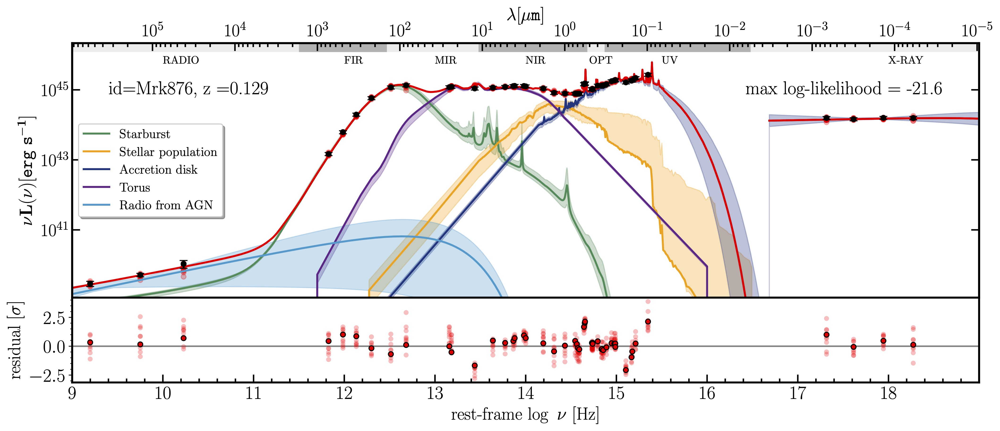

AGNfitter 
========
**A Bayesian MCMC approach to fitting Spectral Energy Distributions of AGN and galaxies**

Welcome to AGNfitter's documentation!
--------

**AGNfitter** is a Python code for modelling the spectral energy distributions (SEDs) of active galactic nuclei (AGN) and galaxies.
While AGNfitter can be applied on the photometry of any galaxy, the code includes a state-of-the-art library of AGN physical models and is ideal to infer detailed physical properties for AGNs, such as quasars, Seyfert galaxies, etc. 

The AGNfitter-rx release
--------

The first version of **AGNfitter** (Calistro-Rivera et al. 2016) has been recently expanded to model radio-to-X-ray photometry in the **AGNfitter-rx** release (Martinez-Ramirez et al. 2024).

Here is the SED-fitting output of the code for the radio-to-X-ray photometry of the nearby AGN Mrk876. The black markers represent the photometric data and the lines of different colours represent the best-fit model and uncertainties for the different physical components listed in the legend. Below we also show the residuals. Additionally the code provides the user with tables with the output values of the physical parameters for the AGN and host galaxy, as well as many other optional output information.

.. note::

   AAA

Here a list of the main features of the code, highlighting the new addition in the AGNfitter-rx release.

* Radio-to-X-ray SED modelling *(new)*
* Easy inclusion of your favorite new models to allow model comparison *(new, :doc:`usage`)*  
* Easy inclusion of filters  *(new, :doc:`usage`)*
* Easy inclusion of user-tailored priors  *(new, :doc:`usage`)*
* Energy balance prior between the stellar population and IR dust emission components *(new)*
* Customized output: including integrated luminosities and AGN fractions at the desired wavelength (ranges)
* Sampled Probability Density Functions (PDFs) for all physical parameters

Requirements
-------------

* Numpy 
* Matplotlib 
* Scipy
* Astropy 
* emcee
* cPickle

Installation
----------------

Installation can be done by cloning this Github repository.

After installation, let's do a quick test:

**1)** In `example/SETTINGS_AGNfitter.py`, go to `def CATALOG_settings()` and change 

.. code::   

   cat['path'] ='/Users/USER/AGNfitter/'
    
to your AGNfitter path. These test settings point to the example catalog contained in  `data/catalog_example.txt`.
    
**2)** In the terminal, go to your AGNfitter path  and start

 .. code::   

   ./RUN_AGNfitter_multi.py  example/SETTINGS_AGNfitter.py
    
You should have a nice example in your `cat['path']/OUTPUT` folder. 

###
Either make sure that the root AGNfitter directory is on your `PATH` or specify the full path to `RUN_AGNfitter_multi.py`.
###

Quick start
------------

**TASK 0 (optional):** If you wish to have a working path other than the AGNfitter code path, please change 

.. code::    

   cat['workingpath'] = cat['path']
    
to your costumized working path.

**TASK 1:** In your working path, configure your settings creating a file `my_SETTINGS_AGNfitter.py`.
This file should be created based on the example in `example/SETTINGS_AGNfitter.py` (copy+paste).
To get AGNfitter running this is the ONLY file you need to modify.

*TASK 1a:* Specify your catalog's format in:

.. code::    

   def CATALOG_settings()
        cat['path'] ='/Users/USER/AGNfitter/'
        cat['filename'] = 'data/catalog_example.txt
        cat['filetype'] = 'ASCII' ## catalog file type: 'ASCII' or 'FITS'. 
        cat['name'] = 0#'ID'            ## If ASCII: Column index (int) of source IDs
        cat...

*TASK 1b:* To construct the dictionary  please go to

.. code::
 
   def FILTERS_settings():
        filters['dict_zarray'] = np.arange(zmin, zmax, zinterval)

Here you can specify the redshift ranges or a redshift array you need for you catalog.
The DICT_default only includes z=[0.283, 1.58] for the test. 
Please, consider this process takes around 0.1 minute per redshift element.
This process might be lengthy but you only have to do it once.

You can use the default combination of photometric bands by leaving

.. code::
  
   filters['Bandset'] = 'BANDSET_default'.

Otherwise, if you like, you can specify the photometric bands included in your catalog by setting 

.. code::

   def FILTERS_settings():
        ...
        filters['Bandset'] = 'BANDSET_settings' 
        
        filters['SPIRE500']= False
        filters['SPIRE350']= True        

and assigning 'True' to the keys corresponding to the photometric bands in your catalog.
    
    
**TASK 2:** Run AGNfitter with

.. code::

   ./RUN_AGNfitter_multi.py my_SETTINGS_AGNfitter.py
   
This will run AGNfitter in series. In general there are a few more runtime options (see below).

Done!  

Citing the code
--------
If AGNfitter is useful for your research project, please include a citation to Calistro-Rivera et al. (2016) *and* Martinez-Ramirez et al. (2024)  in any publications. 
You can find the bibtex entries here:

.. code::    

   @ARTICLE{2016ApJ...833...98C,
          author = {{Calistro Rivera}, Gabriela and {Lusso}, Elisabeta and {Hennawi}, Joseph F. and {Hogg}, David W.},
           title = "{AGNfitter: A Bayesian MCMC Approach to Fitting Spectral Energy Distributions of AGNs}",
         journal = {\apj},
        keywords = {galaxies: active, galaxies: nuclei, galaxies: statistics, methods: statistical, quasars: general, Astrophysics - Astrophysics of Galaxies, Astrophysics - Instrumentation and Methods for Astrophysics},
            year = 2016,
           month = dec,
          volume = {833},
          number = {1},
             eid = {98},
           pages = {98},
             doi = {10.3847/1538-4357/833/1/98},
   archivePrefix = {arXiv},
          eprint = {1606.05648},
    primaryClass = {astro-ph.GA},
          adsurl = {https://ui.adsabs.harvard.edu/abs/2016ApJ...833...98C},
         adsnote = {Provided by the SAO/NASA Astrophysics Data System}
   }

Contents
--------

.. toctree::

   usage
   api
